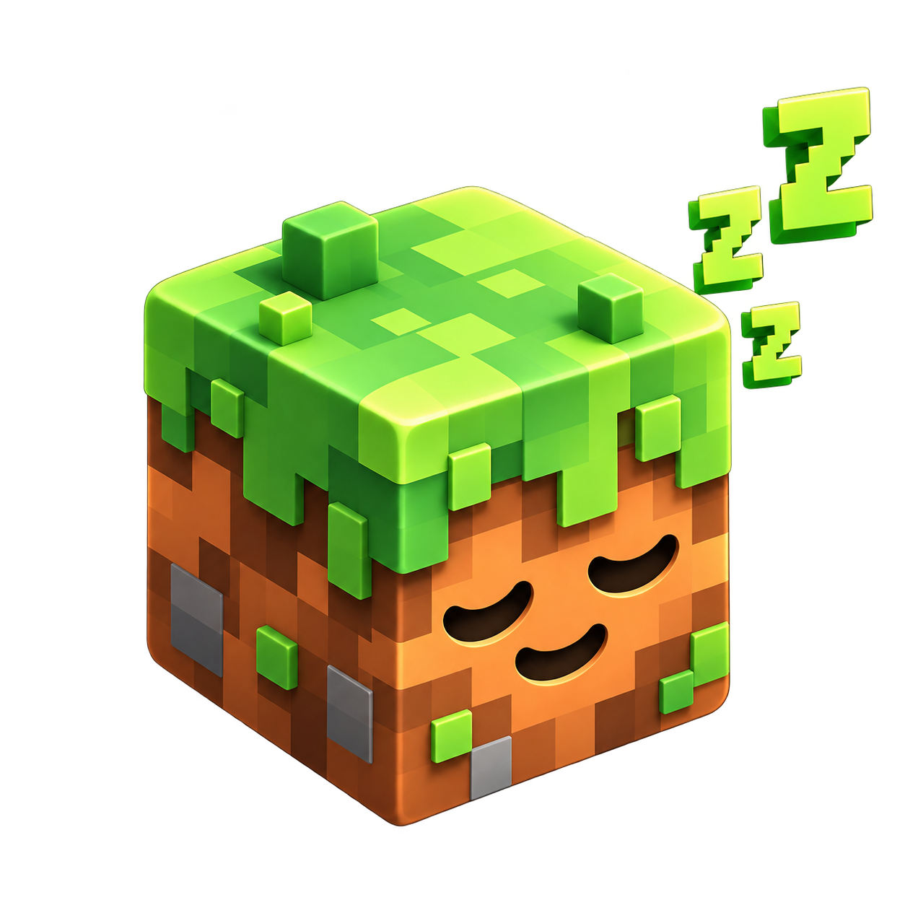
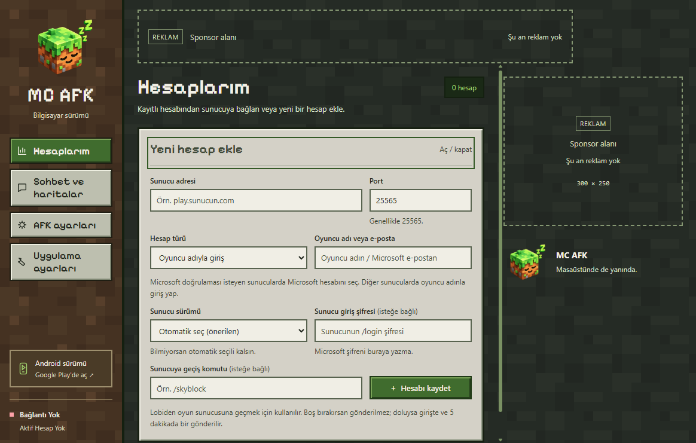

# MC AFK · Windows

### MC AFK artık bilgisayarında.

Minecraft Java sunucularına bağlan, hesaplarını tek ekrandan yönet ve sohbeti masaüstünden takip et.

**Taşınabilir EXE** · **Türkçe arayüz** · **Java 1.8.8–26.1**

---

## Neler yapabilirsin?

| | MC AFK ile |
| :--- | :--- |
| **Hesaplar** | Birden fazla hesap ekle, ayrı bağlantıları tek ekrandan izle. Uygulamada sabit hesap sınırı yoktur. |
| **Canlı durum** | Bağlantı, can, tokluk, konum, ping ve eldeki eşya bilgilerini gör. |
| **Sohbet ve haritalar** | Hesap seçerek mesaj gönder, komut çalıştır ve sunucu kayıtlarını takip et. |
| **AFK ayarları** | Otomatik hareket, yemek, tıklama ve tekrarlanan komutları hesabına göre ayarla. |
| **Sunucu haritaları** | Sunucunun gönderdiği harita ve doğrulama görsellerini 2× veya 3× büyüt. |
| **Sürüm seçimi** | Java sürümünü otomatik algıla veya 1.8.8–26.1 listesinden seç. |

Bağlantı kapasitesi bilgisayarına ve sunucuya bağlıdır. Harita ekranında sunucunun gönderdiği görseller yer alır.

## Üç adımda başla

1. **[Windows EXE’yi indir](https://github.com/BerkeX1/mc-afk-desktop/releases/download/v0.1.9/MC-AFK-0.1.9-Windows.exe)** ve çalıştır. Ayrı kurulum veya Node.js gerekmez.
2. **Hesaplarım → Yeni hesap ekle** alanında sunucunu ve hesabını gir; **Hesabı kaydet** düğmesine bas. Sunucu giriş şifresi ve geçiş komutu isteğe bağlıdır.
3. Hesap kartından **Sunucuya bağlan** düğmesine bas. Mesaj göndermek veya görsel açmak için **Sohbet ve haritalar** ekranında hesabını seç.

Pencereyi kapattığında uygulama sistem tepsisinde çalışmaya devam eder. Tamamen çıkmak için tepsi menüsünü kullan.

## Güncellemeler ve destek

- **[Tüm Windows sürümleri](https://github.com/BerkeX1/mc-afk-desktop/releases)**
- **[Hata bildir / öneri paylaş](https://github.com/BerkeX1/mc-afk-desktop/issues)**
- **[Android uygulamasını Google Play’de aç](https://play.google.com/store/apps/details?id=com.berkex.mcafk)**

**Güncel sürüm: 0.1.9 · Deneme sürümü**
